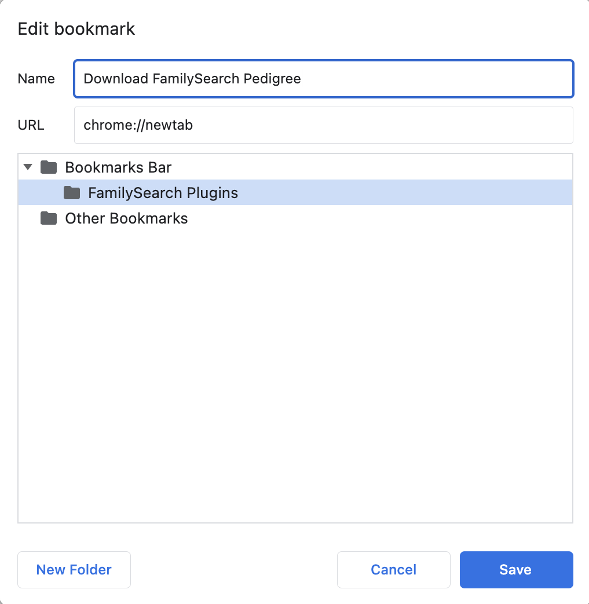

How To Install FamilySearch Plugins (Chrome Only)  
=================================================

Show Bookmarks Bar:
-------------------

For Mac: Command+Shift+B  
For Windows: Control+Shift+B

Create a new Folder Labeled "FamilySearch Plugins":
---------------------------------------------------

Right-click the bookmarks bar, select "Add Folder", and name it "FamilySearch Plugins"

 

To install the Save-Pedigree script (Don't bother with the pictures, they're semi-incorrect, but I'll fix 'em later):
---------------------------------------------------------------------------------------------------------------------

Right-click the folder you just created, and select "Add Page"

Rename the page to "Download FamilySearch Pedigree",  
And replace the existing URL with this text below:

javascript:(function(){fetch('https://raw.githubusercontent.com/twarped/easypedigree/master/downloadpedigree.js').then(body=>body.text()).then(code=>{var script=document.createElement("script");script.innerHTML=code;document.head.appendChild(script)})}());

 

To install the Upload-Pedigree script (Don't bother with the pictures, they're semi-incorrect, but I'll fix 'em later):
-----------------------------------------------------------------------------------------------------------------------

Right-click the "FamilySearch Plugins" folder, and select "Add Page"

Rename the page to "Upload FamilySearch Pedigree",  
And replace the existing URL with this text below:

javascript:(function(){fetch('https://raw.githubusercontent.com/twarped/easypedigree/master/uploadpedigree.js').then(body=>body.text()).then(code=>{var script=document.createElement("script");script.innerHTML=code;document.head.appendChild(script)})}());

 

To Use:
-------

In theory, it's pretty simple.

### For the Download Script:

Currently, you have to be in portrait pedigree mode to download the pedigree. I chose portrait because it's the most common mode for going far back. You can try it with other modes, but it probably won't work the way you want/expect it to.  
  
You also have to have the pedigree loaded on the FamilySearch website.  
  
It's not the best solution currently, but it works okay enough for now.

### For the Upload Script:

You can be anywhere to use the plugin, as long as you are in chrome. It will by default send you to a portrait pedigree on FamilySearch, prompt you to open a saved pedigree, and then click all the buttons for you. It's still in beta, so it kinda sucks.  
  
It can't tell if they've updated your family tree, so if it doesn't go as far as it should, you could try again, but chances are, they updated your family tree. It also can't tell you when your done, but it works-ish.  
  
You can also load a saved pedigree from inside the [Pedigree Formatter](https://twarped.github.io/easypedigree/formatpedigree.html) page on the top navigation bar. It literally says "Open Saved Pedigree In FS"
